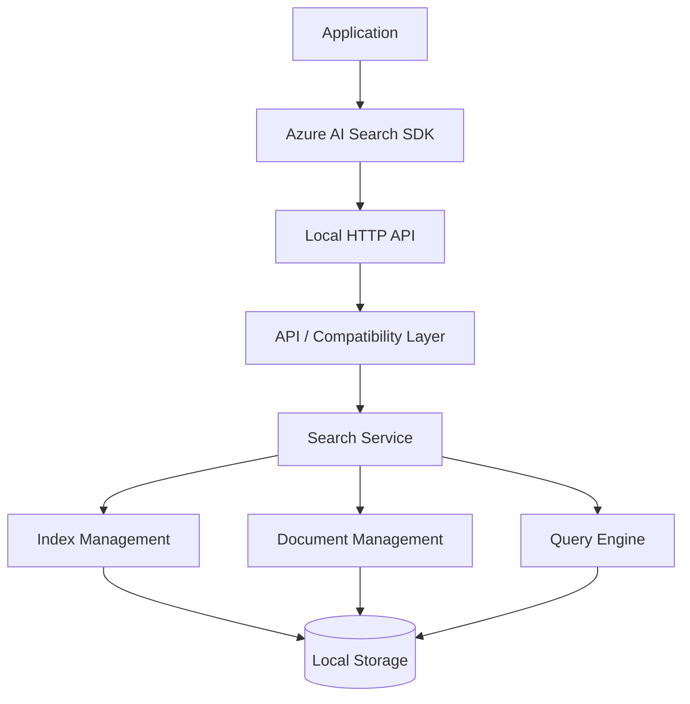
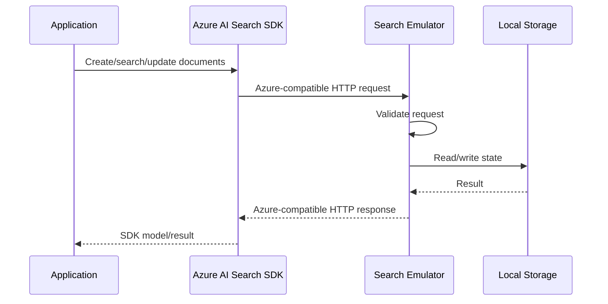
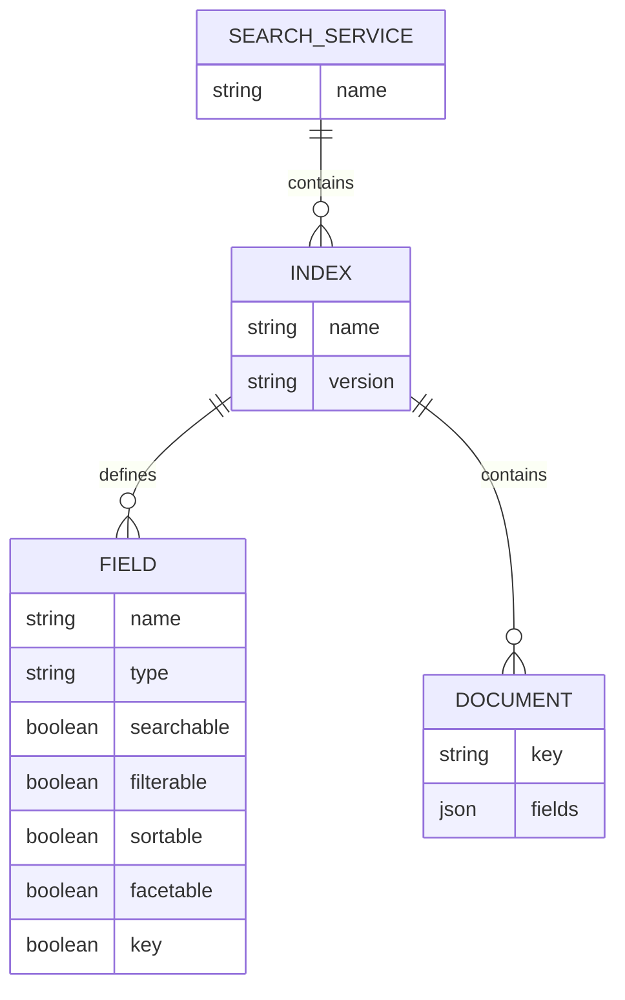
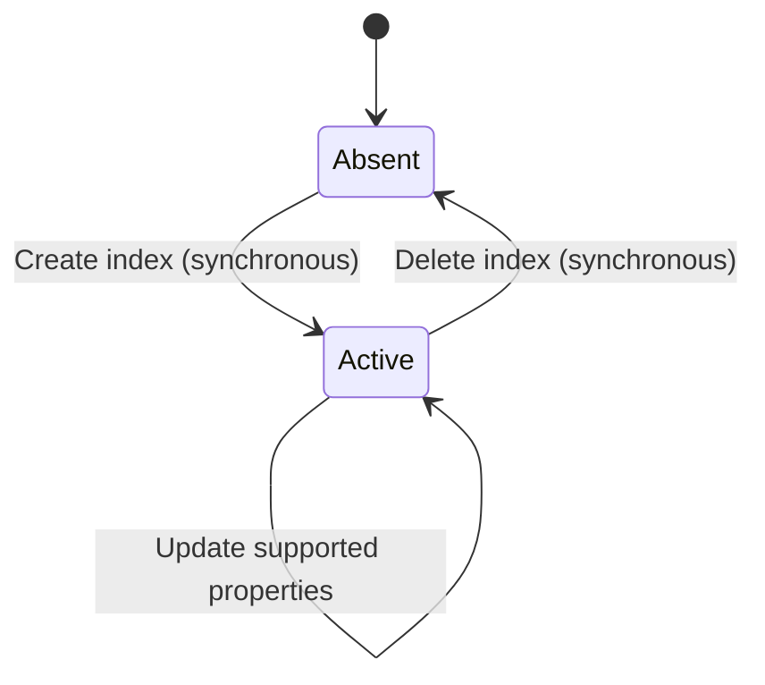
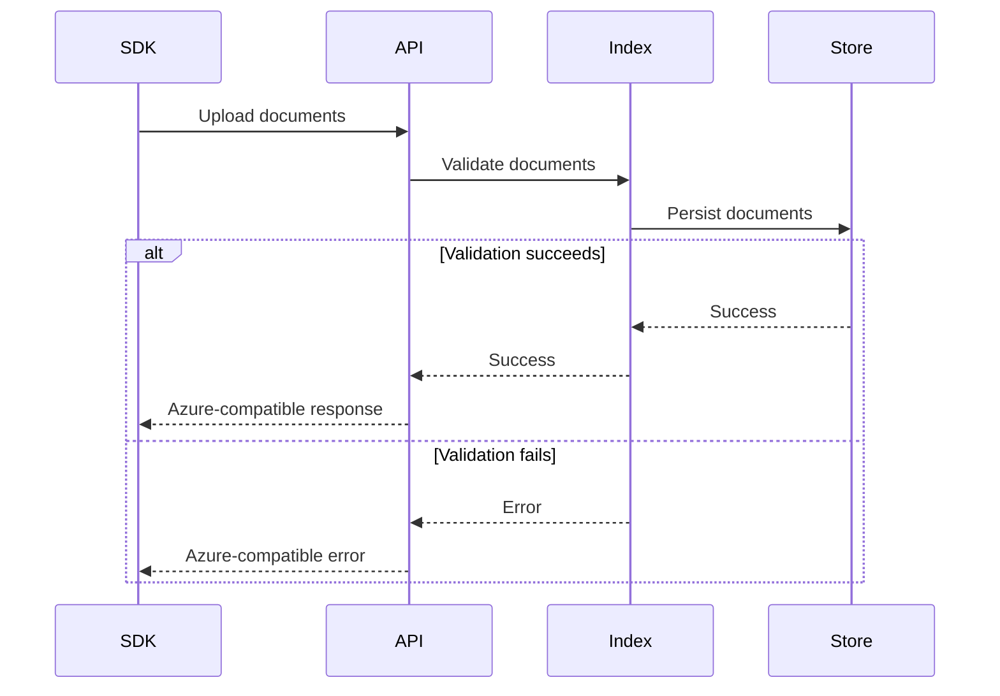
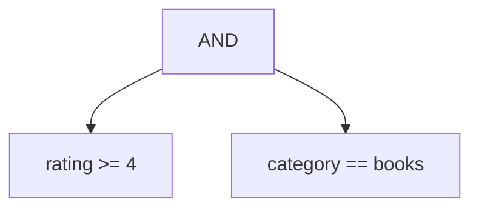
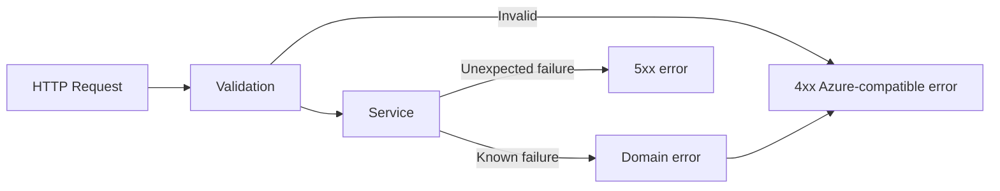
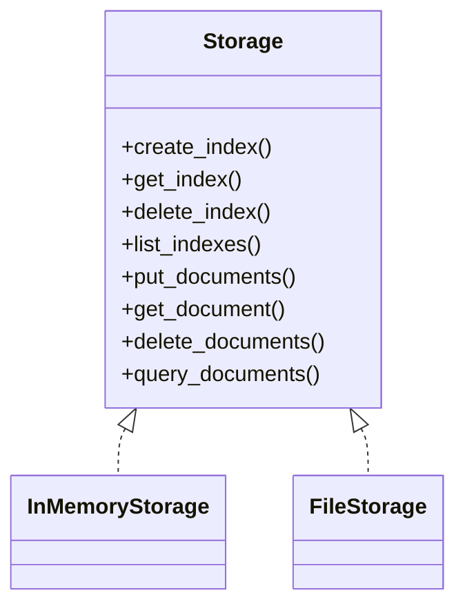
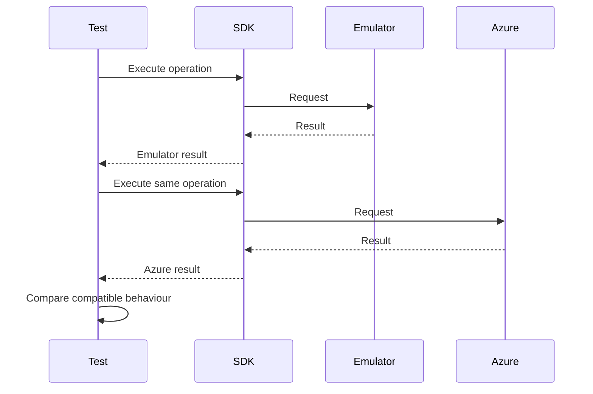

# Azure AI Search Local Emulator Design Doc

## Problem statement

Applications in development and automated testing currently depend on Azure AI Search as an external service.

This creates several problems:

* Local development requires access to an Azure AI Search instance.
* Integration tests require shared or provisioned Azure infrastructure.
* Tests can become dependent on network connectivity and external service availability.
* Test data can leak between developers or test runs when shared search services are used.
* Provisioning and configuring Azure AI Search adds significant setup time to development environments and CI pipelines.
* Some behaviours are difficult to test deterministically against the real service.
* Developers may avoid exercising search functionality locally because the service is inconvenient to provision.

We want to provide a **local emulator for Azure AI Search** that allows existing application code to run against a local service with minimal or no application-level changes.

The emulator will use the existing **Azure AI Search API clients as the behavioural reference**. Python will be the initial client/reference implementation, with C# support added subsequently.

The goal is not to reproduce the implementation of Azure AI Search. Instead, the emulator should reproduce the observable API behaviour required by our applications and tests.

The emulator should therefore be considered a **compatible test double with a persistent search implementation**, rather than a complete reimplementation of Azure AI Search.

## Requirements

### Goals

The emulator must:

1. Provide a local HTTP service that applications can connect to instead of Azure AI Search.
2. Support the Azure AI Search API operations required by existing applications.
3. Be compatible with the existing Python Azure AI Search client.
4. Be designed so that C# Azure AI Search client compatibility can subsequently be added.
5. Store indexes and indexed documents locally.
6. Support deterministic test execution.
7. Allow independent test runs to create and destroy search state.
8. Support the core indexing and querying functionality used by applications.
9. Return responses with the structure and semantics expected by the Azure SDKs.
10. Provide useful error responses for unsupported or invalid operations.
11. Run without requiring Azure credentials or network access to Azure.
12. Be straightforward to run in local development and CI environments.
13. Make it possible to extend the supported API surface incrementally.

### Compatibility goals

Compatibility will be defined primarily by the behaviour observed through the official Azure AI Search clients.

The emulator should preserve:

* Request and response models.
* HTTP methods and endpoint structure where required by the clients.
* HTTP status codes for supported operations.
* Error response structures where practical.
* Index and field semantics required by the clients.
* Document CRUD semantics.
* Search result structure.
* Filtering semantics required by applications.
* Ordering and pagination semantics where required.
* Index lifecycle semantics.

Where Azure AI Search exposes functionality that is not required by our applications, compatibility is not initially required.

### Non-goals

The emulator will not initially attempt to:

* Reproduce all Azure AI Search APIs.
* Reproduce Azure's internal search/indexing architecture.
* Provide production-scale performance.
* Provide distributed or highly available search.
* Reproduce Azure's infrastructure, networking, authentication or billing.
* Guarantee byte-for-byte equivalence with Azure search results.
* Implement every Azure AI Search query language feature.
* Implement Azure-hosted AI enrichment services unless explicitly required.
* Emulate Azure Portal functionality.
* Act as a drop-in replacement for production Azure AI Search without qualification.

The supported API surface will be driven by actual client usage and application requirements rather than attempting to implement the entire Azure service specification up front.

## High-level design

The emulator will expose an HTTP API that is compatible with the Azure AI Search API surface consumed by the official SDKs.

The SDK remains responsible for constructing requests and interpreting responses. The emulator implements the service-side behaviour.

Internally, the emulator will consist of:

1. **HTTP/API layer**

   * Receives Azure AI Search-compatible requests.
   * Performs request validation.
   * Converts requests into internal operations.
   * Serialises responses using Azure-compatible models.

2. **Service layer**

   * Implements search-service operations.
   * Manages indexes.
   * Manages documents.
   * Executes searches.
   * Applies filters, ordering and pagination.

3. **Storage layer**

   * Persists index definitions and documents.
   * Provides isolation between indexes.
   * Provides deterministic state management for tests.

4. **Search engine**

   * Provides text search and structured querying.
   * Backed by **Tantivy** (https://github.com/quickwit-oss/tantivy), a Rust full-text search library modelled on Apache Lucene. Tantivy is an embedded, in-process dependency rather than a separate service, so the emulator remains a single static binary.
   * Initially implements only the query features required by consumers.
   * Can be replaced or extended independently of the API layer. See `docs/decisions/0003-search-engine.md`.

5. **Compatibility layer**

   * Maps Azure API concepts onto the emulator's internal representation.
   * Provides Azure-compatible errors and response structures.
   * Allows client-specific quirks to be handled without contaminating the core search implementation.



From the perspective of an application developer, the important difference is simply:

```text
Azure AI Search SDK
        |
        +---- Azure Search Service
        |
        OR
        |
        +---- Local Search Emulator
```

The application should not need to know which implementation is being used beyond configuration of the service endpoint and credentials.

### Pros

* **Low application coupling** — applications continue to use the existing Azure SDK rather than a bespoke emulator client.
* **Realistic integration testing** — requests pass through the same SDK code used in production.
* **Deterministic local development** — search state can be created and destroyed locally.
* **Fast feedback** — local requests avoid Azure network latency and service provisioning.
* **Incremental implementation** — the API surface can grow as new application requirements are discovered.
* **Clear compatibility boundary** — compatibility can be tested at the HTTP/API boundary.
* **Language independence** — implementing the HTTP contract allows Python and C# clients to use the same emulator.

### Cons

* The emulator will inevitably differ from Azure AI Search in some edge cases.
* Search relevance may not exactly match Azure's ranking algorithms.
* Maintaining compatibility with Azure SDK behaviour requires ongoing work as SDK versions change.
* Some Azure functionality may be expensive or impractical to reproduce locally.
* A local emulator can create false confidence if tests depend on behaviour that differs from production Azure.

These limitations are acceptable because the primary objective is **local development and deterministic integration testing**, not production equivalence.

Tests that specifically validate Azure behaviour should continue to run against a real Azure AI Search instance.

## Detailed design

### Compatibility boundary

The primary compatibility boundary is the HTTP API consumed by the official Azure AI Search SDK.

The emulator should not initially expose a separate application-specific API.



This is important because it ensures that compatibility is tested using the same client path as production.

### API surface discovery

The initial API surface will be derived from the existing Python clients.

The implementation process should be:

1. Identify all Azure AI Search client classes used by applications.
2. Identify all methods called by those clients.
3. Identify the HTTP requests generated by those methods.
4. Capture request and response schemas.
5. Identify required error conditions.
6. Implement only the required subset.
7. Add contract tests for each supported operation.
8. Repeat the process when C# support is introduced.

The Python SDK therefore acts as the initial **reference client**.

The C# SDK should subsequently be treated as an independent compatibility consumer rather than assuming that Python and C# necessarily exercise exactly the same HTTP behaviour.

### Client configuration

Applications should be able to switch between Azure and the emulator through configuration.

Conceptually:

```text
SEARCH_ENDPOINT=https://real-service.search.windows.net
```

becomes:

```text
SEARCH_ENDPOINT=http://localhost:<port>
```

Authentication should be configurable independently.

The emulator should accept the credential format expected by the SDK where practical, but should not require valid Azure credentials.

The emulator accepts any non-empty `api-key` header and ignores its value. A missing or empty key returns `401` with the Azure error structure. See `docs/decisions/` for the exact rule.

Authentication should therefore be treated as a compatibility mechanism rather than a security boundary.

### Service model

The emulator will model the following primary resources:



The exact representation of these resources is an implementation detail.

The important property is that the emulator maintains the same conceptual resource hierarchy as Azure AI Search.

### Index lifecycle

Indexes are persistent resources containing:

* Index name.
* Field definitions.
* Key field.
* Search configuration required by supported queries.
* Other supported index configuration.

The initial lifecycle is synchronous:



The emulator should distinguish between:

* Index does not exist.
* Index exists but contains no documents.
* Index exists and contains documents.

All index lifecycle operations complete synchronously. Where the real API exposes asynchronous behaviour (e.g. long-running index operations), the emulator completes the operation immediately and returns the final state unless asynchronous behaviour is specifically required for SDK compatibility.

### Index schema

Index definitions should be represented using the same concepts exposed by the Azure SDK.

At minimum, the emulator should understand:

* Field name.
* Field type.
* Key fields.
* Searchable fields.
* Filterable fields.
* Sortable fields.
* Facetable fields.
* Collection fields.
* Complex fields where required.

The emulator should validate schemas at index creation time.

For unsupported field types or capabilities, it should fail explicitly rather than silently ignoring configuration.

This is preferable because silently accepting unsupported schema configuration can cause tests to pass locally while behaving differently in Azure.

### Document storage

Documents are associated with an index and identified by the index's key field.

The emulator must support the document operations actually used by applications, potentially including:

* Upload.
* Merge.
* Merge-or-upload.
* Delete.
* Batch operations.

Document operations should be atomic at the level exposed by the API where practical.

For example:



### Search

Search requests will be converted into an internal query representation.

Conceptually:

```text
Azure Search Request
        |
        v
Request parser
        |
        v
Internal Query
        |
        +--> Full text query
        +--> Filters
        +--> Ordering
        +--> Projection
        +--> Pagination
        +--> Facets
        |
        v
Query Engine
        |
        v
Search Results
        |
        v
Azure-compatible response
```

The internal query representation is important because it prevents the underlying search implementation from being tightly coupled to Azure's HTTP representation.

### Query support

Query functionality should be implemented according to actual application usage.

Potential functionality includes:

* Full-text search.
* Exact matching.
* Field-specific searches.
* Boolean operators.
* Filters.
* Numeric comparisons.
* String comparisons.
* Collection filtering.
* Ordering.
* Pagination.
* Select/projection.
* Facets.
* Search result counts.
* Search scoring.

Each feature should have explicit compatibility tests.

Unsupported query syntax should result in a clear error rather than being silently interpreted differently.

### Search relevance

Exact parity with Azure AI Search relevance is not an initial requirement.

Azure's search ranking can depend on implementation-specific indexing and ranking algorithms.

The emulator should instead provide deterministic ranking suitable for local development and testing.

Where tests depend on exact ordering, tests should either:

* explicitly specify ordering, or
* assert result membership rather than exact relevance ordering.

If applications require Azure-compatible relevance for a particular feature, that requirement should be added explicitly to the emulator design rather than assumed.

### Filtering

Filters should be parsed into an internal expression tree.

For example:

```text
rating ge 4 and category eq 'books'
```

could become:



This provides a clean separation between:

* Azure filter syntax.
* Internal filter evaluation.
* Document storage.

The filter parser should reject unsupported syntax rather than attempting to approximate it.

### Pagination

The emulator must support the pagination mechanisms required by the Azure SDK and applications.

At minimum this should include:

* Result limits.
* Skip/offset where supported.
* Continuation tokens where required.

Continuation tokens should be deterministic within a search state.

The implementation should avoid exposing internal storage identifiers directly as continuation tokens.

The token scheme is: `base64(json{filter, orderby, skip, state_version})` where `state_version` is a monotonically increasing counter incremented on every document mutation. The token is opaque to the client; the server validates `state_version` matches the current state before resuming, and returns a `400` with a clear "stale continuation token" error if it does not.

### Error handling

The API layer should translate internal failures into Azure-compatible HTTP responses.

Errors should distinguish between categories such as:

* Invalid request.
* Invalid index.
* Index not found.
* Document not found.
* Invalid document.
* Unsupported operation.
* Invalid query.
* Internal emulator failure.

The implementation should maintain a consistent mapping between internal errors and external API responses.



### Persistence

The emulator should support a persistent local storage implementation so that it can be used both interactively and in test environments.

The storage abstraction should allow multiple implementations.



The initial implementation may use in-memory storage for simplicity, provided the architecture does not prevent persistent storage being added later.

For integration testing, an in-memory mode is particularly useful because it gives each emulator process an isolated state.

A file-backed implementation can subsequently provide state persistence for local development.

### Test isolation

Test isolation is a first-class requirement.

The emulator should make it possible to:

* Start with an empty service.
* Create uniquely named indexes.
* Delete indexes after tests.
* Reset the complete service state.
* Run multiple emulator instances independently.

The preferred isolation model is a separate emulator instance per test suite or test environment.

Where that is impractical, explicit service reset functionality should be provided.

### Concurrency

The emulator is expected to run primarily as a local development and CI service.

It does not need to reproduce the distributed concurrency characteristics of Azure AI Search.

However, concurrent HTTP requests must not corrupt emulator state.

The storage layer should therefore provide appropriate locking/transaction semantics for:

* Index creation/deletion.
* Document updates.
* Document deletion.
* Concurrent searches against changing documents.

Search consistency should be deterministic.

The emulator should document whether newly indexed documents are immediately searchable. The initial implementation should favour immediate consistency because it makes local testing deterministic.

### API versioning

Azure AI Search exposes API versions and SDK versions can generate different requests.

The emulator should therefore capture the API version from incoming requests where applicable.

Initially, the emulator may support one explicitly selected API version.

Unsupported API versions should result in a clear error.

The compatibility layer should isolate version-specific behaviour:

```text
HTTP API
   |
   +-- API version adapter
          |
          +-- Internal service model
```

This allows additional API versions to be implemented without duplicating the core search engine.

### Observability

The emulator should provide sufficient logging to diagnose compatibility problems.

At minimum, logs should make it possible to determine:

* HTTP method.
* Endpoint.
* API version.
* Index involved.
* Operation.
* Request validation failures.
* Search query parsing failures.
* Internal exceptions.

Request bodies should not automatically be logged because indexed documents may contain application data.

Debug logging may optionally expose sanitised request information.

### Health and lifecycle

The emulator should provide a minimal health mechanism for orchestration and CI.

This is operational functionality rather than part of the Azure compatibility surface.

It should therefore be implemented separately from the Azure-compatible API.

Examples include:

```text
GET /health
```

and process-level startup/shutdown handling.

These endpoints are deliberately not intended to reproduce Azure AI Search.

### Implementation language and architecture

The emulator is written in **Rust**, to leverage mature existing libraries and provide fast startup times and a small, static deployment artifact.

Two toolchains are used in this project:

* **Emulator (Rust):** the HTTP service, query engine, and storage. Built with Cargo, tested with `cargo test`, linted with `cargo clippy`, formatted with `cargo fmt`.
* **SDK compatibility harness (Python / C#):** test-only code that exercises the emulator through the official Azure SDKs. Python harness uses Poetry + pytest + testcontainers-python. C# harness (Phase 3) uses a .NET test project. These are not part of the emulator binary.

The Python Azure AI Search SDK remains the initial reference client for compatibility.

The full-text search and indexing backend is **Tantivy** (https://github.com/quickwit-oss/tantivy), a Rust library modelled on Apache Lucene. It is used as an embedded dependency behind the query-engine abstraction rather than rolling our own full-text search, and rather than depending on a separate Lucene/Elasticsearch/OpenSearch service. See `docs/decisions/0003-search-engine.md`.

The architecture should separate:

```text
HTTP framework
      |
API compatibility
      |
Domain/service layer
      |
Query engine
      |
Storage
```

This separation is important because HTTP compatibility, search semantics and persistence are independently replaceable concerns.

The emulator should avoid putting business logic directly into HTTP endpoint handlers.

### Python client compatibility

The Python Azure AI Search SDK will be used as the first compatibility target.

Compatibility tests should exercise the SDK itself rather than manually constructing HTTP requests wherever possible.

For example:

```python
client = SearchClient(
    endpoint=emulator_endpoint,
    index_name="documents",
    credential=credential,
)

results = client.search("example")
```

The test should verify that the SDK can communicate with the emulator and return the expected SDK-level result.

The same approach should be used for index-management and document-management clients.

### C# client compatibility

C# compatibility will be added after the Python API surface has stabilised.

The C# SDK should be treated as another consumer of the HTTP contract.

Compatibility tests should therefore look like:

```text
             +--------------------+
             | Local Search API   |
             +---------+----------+
                       |
              +--------+--------+
              |                 |
       Python SDK          C# SDK
              |                 |
        Python tests       C# tests
```

This prevents the emulator from becoming accidentally coupled to Python-specific SDK behaviour.

### Contract testing

The emulator should have a contract test suite organised by API capability.

For example:

```text
tests/contract/
    index_management.rs
    document_management.rs
    search.rs
    filtering.rs
    pagination.rs
    errors.rs

source/tests/python/tests/
    sdk/            # SDK compatibility tests (official Python SDK)
    e2e/            # end-to-end tests (testcontainers)

source/tests/csharp/    # C# SDK compatibility tests (Phase 3)
```

Tests should ideally operate at three levels:

1. **Unit tests**

   * Query parser.
   * Filter parser.
   * Storage.
   * Domain logic.

2. **HTTP contract tests**

   * Requests and responses.
   * HTTP status codes.
   * Error structures.

3. **SDK compatibility tests**

   * Official Python SDK.
   * Later official C# SDK.

The SDK compatibility tests provide the strongest evidence that the emulator is usable by real applications.

### Azure comparison tests

Where behaviour is ambiguous, the emulator should be tested against a real Azure AI Search instance.



The comparison should focus on externally observable contract behaviour.

Not every difference should be considered a compatibility failure.

For example, differing relevance scores may be acceptable if the emulator's documented goal is deterministic local search rather than ranking equivalence.

## Alternatives considered

### Alternative 1 — Mock the Azure AI Search SDK

Applications would mock the Python/C# SDK clients directly rather than running a local service.

#### Pros

* Very simple to implement.
* Extremely fast tests.
* No HTTP server required.
* Tests can control every response.

#### Cons

* Does not exercise the real SDK.
* Does not test serialisation/deserialisation.
* Does not test HTTP behaviour.
* Mocks can easily diverge from Azure.
* Application code can accidentally depend on mock-specific behaviour.
* Requires separate mocks for Python and C#.

#### Overall reason for rejection

This is useful for unit testing individual application components but does not solve the local integration-testing problem.

The emulator should provide a real service boundary instead.

### Alternative 2 — Use a real Azure AI Search instance for all integration tests

Applications would always communicate with Azure AI Search.

#### Pros

* Maximum production fidelity.
* No compatibility implementation required.
* Tests exercise the real service.

#### Cons

* Requires network access.
* Requires Azure resources.
* Increased test execution time.
* Infrastructure provisioning and teardown.
* Potential cost.
* Shared test environments introduce state-isolation problems.
* Less convenient for local development.
* Some tests become dependent on external infrastructure availability.

#### Overall reason for rejection

Real Azure testing remains valuable for production-compatibility tests, but it is unnecessarily expensive and slow for the majority of local and CI integration tests.

The emulator complements rather than completely replaces Azure-based tests.

### Alternative 3 — Implement a bespoke application-level search API

Applications would use an internal abstraction such as:

```text
SearchRepository
        |
        +-- Azure implementation
        +-- Local implementation
```

The local implementation would not attempt Azure API compatibility.

#### Pros

* Clean application abstraction.
* Emulator implementation can be significantly simpler.
* No requirement to reproduce Azure's HTTP API.
* Search semantics can be designed specifically for the application.

#### Cons

* Requires application changes.
* Does not test the Azure SDK integration.
* Python and C# applications would require separate abstractions.
* Can conceal incompatibilities with the production service.
* Encourages divergence between local and production behaviour.

#### Overall reason for rejection

An application abstraction may still be useful architecturally, but it should not be the primary mechanism for emulating Azure AI Search.

The objective is specifically to allow existing clients to operate against a local service.

### Alternative 4 — Use an existing open-source search engine directly

The emulator could expose a thin API over an existing search engine such as Elasticsearch, OpenSearch, Lucene or another full-text search implementation.

#### Pros

* Mature search implementations.
* Good indexing and query performance.
* Potentially sophisticated relevance algorithms.
* Reduced need to implement search indexing from scratch.

#### Cons

* Server-based engines (Elasticsearch, OpenSearch, Lucene over the JVM) add a substantial external dependency and a separate process/service.
* Azure query semantics still need to be translated.
* Azure index semantics do not map perfectly onto other search engines.
* Deployment becomes more complicated.
* Search results may still differ substantially from Azure.
* The implementation can become dominated by translation between two APIs.

#### Overall reason for rejection (server-based engines)

A separate, server-based search engine is rejected because it conflicts with the goal of a single, fast-starting, static Rust binary that is trivial to run in local development and CI.

#### Adopted variant — embedded Rust search library (Tantivy)

The underlying concern in this alternative — not rolling our own full-text search — is addressed by adopting **Tantivy** (https://github.com/quickwit-oss/tantivy), a Rust full-text search library modelled on Apache Lucene, as the query/indexing backend.

Unlike a server-based engine, Tantivy is an embedded, in-process Cargo dependency: it provides Lucene-equivalent indexing and full-text querying without a JVM, a separate service, or added deployment complexity. It is used strictly as an implementation detail behind the emulator's query-engine abstraction and does not define the emulator's architecture or its Azure-compatible API surface. See `docs/decisions/0003-search-engine.md`.

### Alternative 5 — Reimplement Azure AI Search completely

The project would attempt to reproduce the full Azure AI Search API and search behaviour.

#### Pros

* Maximum theoretical compatibility.
* Broadest SDK support.
* Could potentially be used as a standalone local replacement.

#### Cons

* Extremely large scope.
* Azure's internal implementation is not publicly reproducible in all respects.
* Significant maintenance burden.
* High risk of never reaching useful completeness.
* Most implemented functionality would not be used by our applications.

#### Overall reason for rejection

The emulator's value comes from supporting the functionality we actually need.

A full Azure AI Search clone would provide a poor return on investment and would make the project substantially harder to maintain.

## Design principles

The following principles should guide subsequent implementation documents.

### 1. Compatibility over completeness

Implement the Azure behaviour required by consumers rather than attempting to implement the entire Azure service.

### 2. The SDK is the reference consumer

Compatibility should be demonstrated using the official Azure SDKs.

### 3. The HTTP contract is the compatibility boundary

The emulator should not require application-specific client changes.

### 4. Fail explicitly

Unsupported Azure functionality should produce explicit errors rather than silently approximating behaviour.

### 5. Determinism over production realism

For local development and testing, deterministic behaviour is generally more valuable than reproducing Azure's distributed implementation details.

### 6. Separate API semantics from search implementation

The API compatibility layer should not dictate how documents are stored or searched internally.

### 7. Keep production validation possible

The emulator should never be considered proof that an application behaves correctly against Azure AI Search.

A smaller set of tests should continue to exercise the real Azure service.

## Implementation document decomposition

The implementation is split into independently reviewable phases, each with its own implementation document:

1. **Phase 0 — Repository setup** (`docs/phase_0_repository_setup.md`)

   * Rust project scaffolding.
   * Tooling (clippy, rustfmt, cargo test).
   * Python test harness scaffolding (Poetry, pytest, testcontainers).
   * CI skeleton.
   * `docs/decisions/` with pinned versions and configuration conventions.

2. **Phase 1 — Application scaffold and end-to-end test** (`docs/phase_1_scaffold_and_e2e.md`)

   * Minimal runnable HTTP service (Rust).
   * Containerisation (multi-stage Dockerfile → static binary).
   * End-to-end tests using the Python SDK and testcontainers.
   * HTTP fixture capture for later C# replay.

3. **Phase 2 — Full API to production usage standard** (`docs/phase_2_production_api.md`)

   * API surface discovery.
   * Index management.
   * Document management.
   * Query engine.
   * Storage.
   * Error handling and API versioning.
   * Contract and SDK compatibility tests.
   * `docs/known_differences.md` (created as gaps are discovered).

4. **Phase 2.1 — Vector indexing and vector search** (`docs/phase_2_1_vector_indexing.md`)

   * Vector field schema and validation.
   * Vector similarity search (HNSW + exact brute-force) and hybrid (vector + full-text) search.
   * `vectorFilterMode` (pre/post) and per-query `exhaustive`.
   * Vector contract, unit, and SDK compatibility tests.

5. **Phase 3 — Admin API and remaining elements** (`docs/phase_3_admin_api_and_remaining.md`)

   * Admin API.
   * C# SDK compatibility (fixture replay + live tests).
   * Azure comparison testing.
   * Packaging and release (binary + Docker image).

## Open questions

The following are resolved during the Phase 2 API surface discovery (see `docs/phase_2_production_api.md` §Discovery) rather than being assumed by individual components:

* Which SDK operations are currently used by applications?
* Which index field types are required?
* Which query/filter syntax is actually required?
* Are vector search capabilities required?
* Are semantic search capabilities required?
* Are suggest/autocomplete operations required?
* Are facets required?
* Are scoring profiles required?
* What level of relevance compatibility is required?
* What Azure error semantics are relied upon by applications?
* Which operations need to be transactionally atomic?
* Does the emulator need to reproduce eventual-consistency behaviour?
* Which behaviours must be identical between Python and C# clients?
* Which tests must continue to run against real Azure AI Search?

The following are resolved in Phase 0 (`docs/decisions/`):

* Which exact Azure AI Search SDK versions are supported (pinned).
* Which Azure API version(s) must be supported (pinned).
* Is persistent state required for local development (default storage mode).
* Configuration naming convention and environment variable names.
* Authentication rule (accepted key format, missing-key behaviour).

These questions should be answered from observed application usage and SDK behaviour rather than from the theoretical breadth of the Azure AI Search API.

## Success criteria

The emulator will be considered successful when:

1. An existing application can point its Azure AI Search endpoint at the emulator through configuration.
2. The application can create and manage the indexes it requires.
3. The application can index its normal documents.
4. The application can execute its normal searches and filters.
5. Existing Python SDK integration tests can run without modification other than endpoint configuration.
6. The same HTTP service can subsequently be consumed by the C# SDK.
7. Tests are isolated and deterministic.
8. Unsupported functionality is clearly identified rather than silently behaving differently.
9. A documented set of tests continues to validate behaviour against a real Azure AI Search service.

The emulator should ultimately make the common development path:

```text
                    ┌──────────────────┐
                    │    Application   │
                    └────────┬─────────┘
                             │
                    Azure AI Search SDK
                             │
                  ┌──────────┴──────────┐
                  │                     │
             Development             Production
                  │                     │
                  ▼                     ▼
          Local Emulator          Azure AI Search
```

with the same application-level client and API model on both paths.
